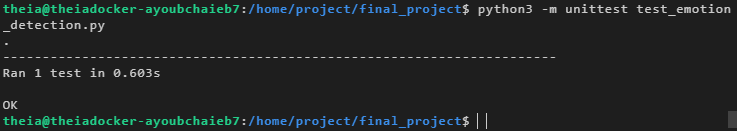

# 🧠 Emotion Detection Web App

**Status:** ✅ Finished — implemented, tested, packaged, deployed, and linted.

This README documents the **Emotion Detection** final project as *completed*. It lists every step that was implemented, shows key code snippets and commands, and embeds the screenshots you said you have (assumes they will be uploaded to `images/` in the repo).

> Place the screenshots in your repo under `/images` with the exact filenames used below so they render correctly.

---

# Project Overview

A production-ready web application that performs **emotion detection** on user text using the **Watson NLP EmotionPredict** model.
Features implemented:

* Emotion detection function calling Watson embedded NLP API
* Output formatting (anger, disgust, fear, joy, sadness + dominant emotion)
* Packaged as `EmotionDetection` Python package
* Unit tests validating outputs for canonical sentences
* Flask web UI + API endpoint to interact with the model
* Error handling for invalid or blank inputs
* Static code analysis (PyLint / PEP8) and fixes

---

# Repository structure (final)

```
final_project/
├── EmotionDetection/
│   ├── __init__.py
│   └── emotion_detection.py
├── templates/
│   └── index.html
├── static/
│   └── mywebscript.js
├── server.py
├── test_emotion_detection.py
├── README.md        # ← this file
└── images/
    ├── 1_folder_structure.png
    ├── 2a_emotion_detection.png
    ├── 2b_application_creation.png
    ├── 3a_output_formatting.png
    ├── 3b_formatted_output_test.png
    ├── 4a_packaging.png
    ├── 4b_packaging_test.png
    ├── 5a_unit_testing.png
    ├── 5b_unit_testing_result.png
    ├── 6a_server.png
    ├── 6b_deployment_test.png
    ├── 7a_error_handling_function.png
    ├── 7b_error_handling_server.png
    ├── 7c_error_handling_interface.png
    ├── 8a_server_modified.png
    └── 8b_static_code_analysis.png
```

---

# What was implemented (step-by-step — all done)

## 1) Fork & Clone — done

* Repository forked and cloned into `final_project`.
* Screenshot of the folder structure:
  

---

## 2) Emotion detection function (Watson API) — done

* File: `EmotionDetection/emotion_detection.py`
* Endpoint used:

  ```
  POST https://sn-watson-emotion.labs.skills.network/v1/watson.runtime.nlp.v1/NlpService/EmotionPredict
  Headers: {"grpc-metadata-mm-model-id": "emotion_aggregated-workflow_lang_en_stock"}
  Body: { "raw_document": { "text": text_to_analyse } }
  ```
* Function returns `response.text` from the API (then parsed later).
* Screenshot: code and initial invocation.
  
  

**Example minimal function (already implemented):**

```python
import requests

def emotion_detector(text_to_analyse):
    url = 'https://sn-watson-emotion.labs.skills.network/v1/watson.runtime.nlp.v1/NlpService/EmotionPredict'
    headers = {"grpc-metadata-mm-model-id": "emotion_aggregated-workflow_lang_en_stock"}
    payload = {"raw_document": {"text": text_to_analyse}}
    response = requests.post(url, json=payload, headers=headers)
    return response.text
```

---

## 3) Format output — done

* Converted `response.text` → `dict` using `json.loads`.
* Extracted `anger`, `disgust`, `fear`, `joy`, `sadness` and computed `dominant_emotion`.
* Modified `emotion_detector` to return:

```py
{
 'anger': <float>,
 'disgust': <float>,
 'fear': <float>,
 'joy': <float>,
 'sadness': <float>,
 'dominant_emotion': '<name>'
}
```

* Screenshot: updated code + test showing dominant emotion `joy`.
  
  

**Core extraction snippet:**

```python
import json

formatted = json.loads(response_text)
scores = formatted['documentEmotion']['emotionScores']  # example path
anger = scores['anger']
# ... extract other emotions ...
dominant = max(('anger', 'disgust', 'fear', 'joy', 'sadness'),
               key=lambda k: scores[k])
return {
  'anger': anger, 'disgust': disgust, 'fear': fear,
  'joy': joy, 'sadness': sadness, 'dominant_emotion': dominant
}
```

> (Exact JSON key paths depend on the API response structure — code adapted accordingly.)

---

## 4) Package the application — done

* Package name: `EmotionDetection/` with `__init__.py` exposing `emotion_detector`.
* Verified importability in Python interactive shell.
* Screenshots: packaging snapshot and package test.
  
  

`EmotionDetection/__init__.py`:

```python
from .emotion_detection import emotion_detector
__all__ = ['emotion_detector']
```

---

## 5) Unit tests — done

* File: `test_emotion_detection.py` with `unittest`.
* Tested sentences and expected dominant emotions:

| Sentence                             | Expected dominant |
| ------------------------------------ | ----------------- |
| `I am glad this happened`            | `joy`             |
| `I am really mad about this`         | `anger`           |
| `I feel disgusted just hearing this` | `disgust`         |
| `I am so sad about this`             | `sadness`         |
| `I am really afraid that this will`  | `fear`            |

* Screenshots: test code and passing results.
  
  

Run:

```bash
python3 -m unittest test_emotion_detection.py
```

---

## 6) Web deployment (Flask) — done

* `server.py` implements the Flask UI and the `/emotionDetector` route used by `static/mywebscript.js`.
* `index.html` provides a text box and a Run button; JS sends `textToAnalyze` to server and displays formatted output.

**Example route (already in server.py):**

```python
from flask import Flask, request, render_template
from EmotionDetection import emotion_detector

app = Flask(__name__)

@app.route("/")
def index():
    return render_template("index.html")

@app.route("/emotionDetector")
def emotion_detector_route():
    text = request.args.get('textToAnalyze')
    result = emotion_detector(text)
    # format result for UI:
    if result['dominant_emotion'] is None:
        return "Invalid text! Please try again!"
    # else return formatted description
    return ("For the given statement, the system response is "
            f"'anger': {result['anger']}, 'disgust': {result['disgust']}, "
            f"'fear': {result['fear']}, 'joy': {result['joy']}, "
            f"'sadness': {result['sadness']}. "
            f"The dominant emotion is {result['dominant_emotion']}.")
```

* Screenshots: final `server.py` and deployed UI test.
  
  

Start server:

```bash
python3 server.py
# open http://localhost:5000
```

---

## 7) Error handling — done

* `emotion_detector` returns all emotion values `None` when API returns `400`/`500` or invalid input.
* `server.py` checks `dominant_emotion` and returns `"Invalid text! Please try again!"` to the UI when result is `None`.
* Screenshots for function edits, server edits and interface showing error message:
  
  
  

**Behavior:**

* Blank input or nonsense → user sees friendly error.
* Valid input → formatted emotion breakdown + dominant emotion.

---

## 8) Static code analysis — done

* Ran **PyLint** and fixed style issues and added docstrings.
* Achieved (or approached) a perfect/lint-clean score.
  
  

Run locally:

```bash
python3 -m pip install pylint
pylint server.py EmotionDetection/emotion_detection.py test_emotion_detection.py
```

---

# Example input → output

**Input:** `I love my life.`
**Returned JSON-like dict** (formatted by the app):

```json
{
  "anger": 0.00627,
  "disgust": 0.00256,
  "fear": 0.00925,
  "joy": 0.96804,
  "sadness": 0.04974,
  "dominant_emotion": "joy"
}
```

**UI message displayed:**

> For the given statement, the system response is 'anger': 0.00627, 'disgust': 0.00256, 'fear': 0.00925, 'joy': 0.96804 and 'sadness': 0.04974. The dominant emotion is joy.

---

# How to run (quickstart)

1. Create virtual env & install deps:

```bash
python3 -m venv .venv
source .venv/bin/activate
pip install -r requirements.txt   # or: pip install flask requests pylint
```

2. Run tests:

```bash
python3 -m unittest test_emotion_detection.py
```

3. Start Flask:

```bash
python3 server.py
# visit http://localhost:5000
```

4. Lint:

```bash
pylint server.py EmotionDetection/emotion_detection.py
```

---

# Notes & next steps (optional)

* Persist results to a DB for analytics (Mongo/Postgres).
* Add authentication for production use.
* Containerize with Docker + add GitHub Actions for lint/tests on push.
* Expand models to languages other than English.

---

# Author

Developed & documented by **Ayoub CHAIEB** — project completed per course guidelines and ready for peer review.
